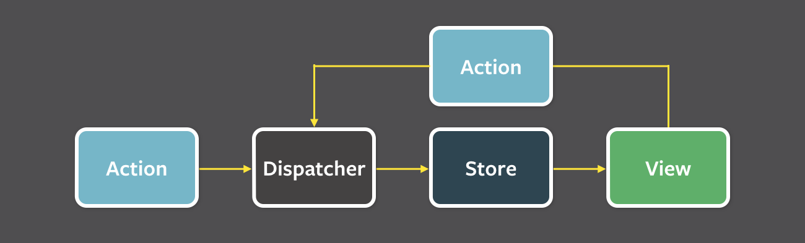

## Qu'est-ce que c'est ?
* Une library orientée composant <!-- .element: class="fragment" -->
* Le Virtual DOM <!-- .element: class="fragment" -->
* Un flux de données unidirectionnel <!-- .element: class="fragment" -->


## Un langage
Le JSX


```jsx
// div.component.jsx

'use strict';
var React = require('react');

var DivComponent = React.createClass({
 render: function () {
   return <div />;
 };
});

module.exports = DivComponent;
```


## Le pattern flux



Plusieurs implémentation de Flux

* Fluxxor
* Fluxible
* Reflux
* ...


## Des outils
* Gulp
* ESLint
* Webpack
* Jest


## ES6


* Rétrocompatible ES5
* Compile du code ES6+ en ES5
* Support à 100% de JSX et React 0.13
* Plugins pour ESLint, Webpack et Jest !


## example ES6
```jsx
// div.component.jsx

import React from 'react';

export default class DivComponent extends React.Component {
  render() {
    return <div />;
  }
}
```
