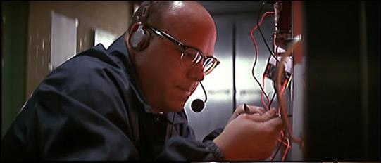

## TP 5
Utilisation de react router


* Le but est d'ajouter une page détail pour nos bières
* Pour cela nous allons utiliser [react-router](https://github.com/rackt/react-router)


### 4 étapes

* Déclarer un container principal qui contient le RouteHandler
* Déclarer nos routes avec leur composant principal
* Mettre en place les liens dans les différentes pages
* Faire le rendu du container dans la page


Le container principal

``` jsx
var Main = React.createClass({

  render: function () {
    return <RouteHandler key="app" />;
  }
});
```


Déclarer les routes

``` jsx
var Main = require('./main.component.jsx');
var Foo = require('./foo.component.jsx');
var Bar = require('./bar.component.jsx');

module.exports = (
  <Route name="main" handler={Main} path="/">
    <DefaultRoute name="foo" handler={Foo} />
    <Route name="bar" path="/bar" handler={Bar} />
  </Route>
);
```


Mettre en place les liens

``` jsx
var Link = require('react-router').Link;
var Foo = React.createClass({

  render: function () {
    return (
      <div>
        <Link to="bar" >Go to bar</Link>
      </div>
    );
  }
});
```


Faire le rendu du RouteHandler

``` jsx
var routes = require('./routes.jsx');
var Main = require('./main.container.jsx');

Router.run(routes, function (Main) {
  React.render(<Main />, document.getElementById('view'));
});
```


Testez ce que vous pouvez




Normalement vous avez tout, mais la doc est là

[https://github.com/rackt/react-router/tree/master/docs/api](https://github.com/rackt/react-router/tree/master/docs/api)
